# Riyadh Airlines Booking System

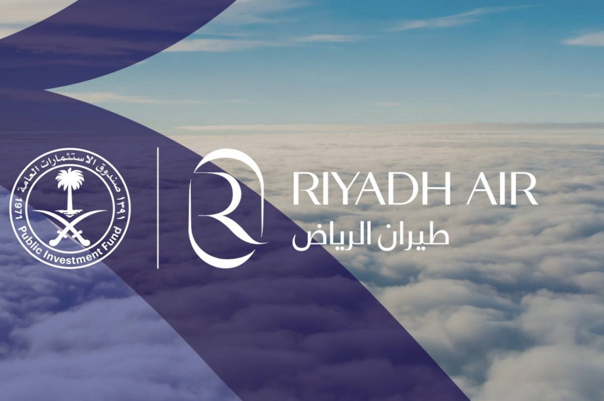

## Introduction

Welcome to the Riyadh Airlines Booking System! This project was developed as part of our graduation requirements under the supervision of Dr. شراحيلي فهد. Our team has worked tirelessly to create an intuitive, user-friendly platform designed to streamline the flight booking process for Riyadh Airlines.

## Table of Contents

1. [Introduction](#introduction)
2. [Project Overview](#project-overview)
3. [Demo Video](#demo-video)
4. [Problem Definition](#problem-definition)
5. [Proposed Solution](#proposed-solution)
6. [System Scope](#system-scope)
   - [Key Functions or Features](#key-functions-or-features)
   - [Users and Stakeholders](#users-and-stakeholders)
   - [Interactions](#interactions)
   - [Limitations and Restrictions](#limitations-and-restrictions)
7. [Goals and Objectives](#goals-and-objectives)
   - [User-Centric Interface Design](#user-centric-interface-design)
   - [Streamlined Booking Process](#streamlined-booking-process)
   - [Responsive Web Design](#responsive-web-design)
   - [Real-time Flight Information](#real-time-flight-information)
   - [User Account Management](#user-account-management)
8. [Timeline](#timeline)
9. [Roles & Responsibilities](#roles--responsibilities)
10. [Technologies and Tools Used](#technologies-and-tools-used)
    - [Development Technologies](#development-technologies)
    - [Project Documentation Tools](#project-documentation-tools)
    - [Local Hosting](#local-hosting)
11. [How to Use the Riyadh Airlines Booking System](#how-to-use-the-riyadh-airlines-booking-system)
    - [Cloning the Repository](#cloning-the-repository)
    - [Configuring the Database Connection](#configuring-the-database-connection)
    - [Importing the Database](#importing-the-database)
      - [Using phpMyAdmin](#using-phpmyadmin)
      - [Using Command Line](#using-command-line)
    - [Flights Dates](#flights-dates)
    - [Default Users](#default-users)
    - [Running the Project](#running-the-project)
    - [Administrator Functionalities](#administrator-functionalities)
    - [Generating Monthly Flights](#generating-monthly-flights)
12. [Project File Structure](#project-file-structure)
13. [System Design](#system-design)
    - [Use Case Diagram](#use-case-diagram)
    - [Sequence Diagram](#sequence-diagram)
    - [Class Diagram](#class-diagram)
    - [Database Design](#database-design)
14. [System Implementation](#system-implementation)
    - [Hardware & Software Tools](#hardware--software-tools)
    - [User Interface (UI)](#user-interface-ui)
15. [System Testing](#system-testing)
16. [Conclusion](#conclusion)
    - [Project Achievements](#project-achievements)
    - [Lessons Learned](#lessons-learned)
17. [Future Work](#future-work)
    - [Feature Enhancements](#feature-enhancements)
    - [Security and Performance Enhancements](#security-and-performance-enhancements)
    - [Integration with External Services](#integration-with-external-services)
    - [Continuous Improvement](#continuous-improvement)
18. [Acknowledgements](#acknowledgements)
19. [Challenges and Personal Reflections](#challenges-and-personal-reflections)
20. [Screenshots](#screenshots)
    - [Home Page](#home-page)
    - [Flight Search](#flight-search)
    - [Booking Page](#booking-page)
    - [Profile Page](#profile-page)
    - [Admin Dashboard](#admin-dashboard)
21. [Copyrights Document](#copyrights-document)
    - [Frontend Templates](#frontend-templates)
    - [Backend and Code Contributions](#backend-and-code-contributions)
    - [Academic Support](#academic-support)
22. [Disclaimer](#disclaimer)
    - [Introduction](#introduction-1)
    - [Project Overview](#project-overview-1)
    - [Fictional Nature](#fictional-nature)
    - [Non-Commercial Intent](#non-commercial-intent)
    - [Educational Purpose](#educational-purpose)
    - [Legal Disclaimer](#legal-disclaimer)
    - [Contact Information](#contact-information)
    - [Acknowledgment](#acknowledgment)

## Project Overview

The Riyadh Airlines Booking System is designed to facilitate the booking of flights for users while providing administrators with the tools necessary to manage reservations and gather relevant flight information efficiently.

## Demo Video

Check out the demo video of the Riyadh Airlines Booking System on YouTube:

[]()

## Problem Definition

Riyadh Airlines lacked an efficient electronic platform for flight bookings, leading to difficulties in managing reservations and providing essential travel information to users.

## Proposed Solution

We developed a comprehensive booking system featuring user registration, flight search, booking management, and administrative tools to improve the overall efficiency and user experience.

## System Scope

### Key Functions or Features

- **Book a Flight:** Users can search for and book flights easily.
- **Administrative Regulation:** Administrators can manage flights and reservations.
- **Additional Features:** User profiles, currency converter, ratings system, email notifications.

### Users and Stakeholders

- **Users:** Individuals looking to book flights.
- **Administrators:** Responsible for managing flights, reservations, and system announcements.

### Interactions

- Users search for flights and make reservations.
- Administrators manage flights and reservations.
- Users interact with additional features like the currency converter and ratings system.

### Limitations and Restrictions

- **Limited Trips:** The system is a prototype with a limited number of trips.
- **Fake Payments:** The payment system is simulated for testing purposes.
- **Limited Administrative Features:** Does not integrate with the government's national ID card (ABSHR).

## Goals and Objectives

### User-Centric Interface Design

Develop an intuitive and user-friendly interface that enables effortless navigation, empowering users to seamlessly search, select, and book flights with ease.

### Streamlined Booking Process

Implement a swift booking mechanism, integrating seamless payment processes to enhance the overall user experience.

### Responsive Web Design

Ensure a responsive and adaptive design, guaranteeing optimal functionality and accessibility across various devices.

### Real-time Flight Information

Integrate real-time flight information updates to keep users informed about schedules, delays, and other relevant changes.

### User Account Management

Develop a user account management system, allowing users to review and modify their profiles, track their booking history, and manage personal information.

## Timeline

| Phase         | Description                                         | Duration |
| ------------- | --------------------------------------------------- | -------- |
| Initiation    | Project initiation, requirement gathering           | 1 month  |
| Planning      | Detailed project planning, resource allocation      | 2 months |
| System Design | Designing the architecture, database schema, UI     | 2 months |
| Development   | Coding and implementation of features               | 1 month  |
| Testing       | System testing, user acceptance testing, bug fixing | 2 weeks  |
| Deployment    | Launching for public use                            | 1 month  |
| Maintenance   | Ongoing support and updates                         | 2 weeks  |

## Roles & Responsibilities

### Project Manager

- **Role:** Overseeing the entire project, ensuring it stays on schedule and within budget.
- **Assigned to:** Mohammed Aleshawi

### Back-End Developer

- **Role:** Developing server-side logic and database integration.
- **Assigned to:** Mohammed Aleshawi

### Front-End Developer

- **Role:** Implementing web design and interactive features.
- **Assigned to:** Mohammed Aleshawi, Yazed Alaosimi, Riyadh Althabet, Sultan Alqahtani

### Documenting Specialist

- **Role:** Creating detailed documentation of the development process.
- **Assigned to:** Mohammed Aleshawi, Riyadh Althabet, Sultan Alqahtani

### Ideas/Concept Developer

- **Role:** Generating innovative ideas for website features.
- **Assigned to:** Yazed Alaosimi

### Testing Specialist

- **Role:** Identifying bugs and issues for resolution.
- **Assigned to:** Mohammed Aleshawi

### Presentation Specialist

- **Role:** Preparing project presentations for stakeholders.
- **Assigned to:** Mohammed Aleshawi, Yazed Alaosimi, Riyadh Althabet, Sultan Alqahtani, Suad Alotaibi

### Database Administrator/Developer

- **Role:** Designing and maintaining the database architecture.
- **Assigned to:** Mohammed Aleshawi

## Technologies and Tools Used

### Development Technologies

- **HTML, CSS, JavaScript:** For crafting the user interface.
- **PHP:** For server-side scripting and dynamic content generation.
- **SQL (MySQL):** For database management.

### Project Documentation Tools

- **Use Case Diagram:** Created using online.visual-paradigm.com.
- **Use Case Description:** Documented using MS Word editor.
- **Sequence Diagram:** Created using Visual Paradigm and sequencediagram.org.
- **Class Diagram:** Created using Visual Paradigm and lucid.
- **Database Design:** ERD created using Erdplus; schema documented using sqldbm and MS Word.

### Local Hosting

- **XAMPP:** Used for local hosting with Apache server.
- **PHPMyAdmin:** For MySQL database management.

## How to Use the Riyadh Airlines Booking System

Welcome to the Riyadh Airlines Booking System! This guide will help you set up the project on your local machine, configure the database, and start using the system.

### Cloning the Repository

To get started, clone the repository from GitHub.

### Configuring the Database Connection

Before you can run the system, you need to configure the database connection. Open the `config.php` file located in the project's root directory and update the database credentials to match your local setup:

```php
<?php
$servername = "localhost";
$username = "root";
$password = "";
$dbname = "graduation_project_db";

// Create connection
$conn = new mysqli($servername, $username, $password, $dbname);

// Check connection
if ($conn->connect_error) {
    die("Connection failed: " . $conn->connect_error);
}
?>
```

### Importing the Database

The project includes an SQL file (`Graduation_Project_db.SQL`) that you need to import into your MySQL database. Due to its large size, you might encounter issues importing it directly through phpMyAdmin. If you face this issue, you can increase the import size limit in your phpMyAdmin configuration or use the command line to import the file.

#### Using phpMyAdmin

1. Open phpMyAdmin in your browser.
2. Create a new database named `graduation_project_db`.
3. Select the newly created database.
4. Go to the "Import" tab.
5. Choose the `Graduation_Project_db.SQL` file from your local machine.
6. Click on "Go" to start the import.

#### Using Command Line

Alternatively, you can use the MySQL command line to import the database:

```bash
mysql -u root -p graduation_project_db < path/to/Graduation_Project_db.SQL
```

### Flights Dates

Due to the limited storage capacity and the current database design, flights are available only for the first month of the year 2025.

### Default Users

After importing the database, there are two default users you can use to log in:

- **User:**

  - Username: `test`
  - Password: `test`
  - Role: `normal_user`

- **Admin:**
  - Username: `Mhmd`
  - Password: `N4zsAK`
  - Role: `ADMIN`

### Running the Project

Ensure you have XAMPP or any other local server running. Place the project folder inside the `htdocs` directory of XAMPP. Start the Apache and MySQL services from the XAMPP control panel. Access the project by navigating to `http://localhost/riyadh-airlines-booking-system` in your browser.

### Administrator Functionalities

As an administrator, you have access to a variety of functionalities:

- **Managing Flights:** Add, edit, and delete flight information.
- **Managing Bookings:** View and manage user bookings.
- **Managing Accounts:** View and manage user accounts.
- **Managing Employees:** Add and manage employee details.
- **System Announcements:** Post announcements to the users.

### Generating Monthly Flights

The project includes a Python script (`generate_monthly_flights.py`) to generate flights for a specific month. Follow these steps to use the script:

1. Open the script in your preferred code editor.
2. Update the `start_date` and `end_date` variables to the desired month and year.

```python
start_date = datetime(2025, 1, 1)  # Start date of the month (YYYY, MM, DD)
end_date = datetime(2025, 1, 31)   # End date of the month (YYYY, MM, DD)
```

3. Run the script:

```python
python generate_monthly_flights.py
```

- Delete all old flights from the flights table.
- Reset the auto-increment value to 1.
- Import the new insert statements from flights_february_realistic.sql.

```sql
TRUNCATE TABLE flights;
ALTER TABLE flights AUTO_INCREMENT = 1;
SOURCE path/to/flights_february_realistic.sql;
```

## Project File Structure

```planetext
PROJECT:
│   flights_february_realistic.sql
│   ganerate_monthly_flights.py
│   Graduation_Project_db.SQL
│   index.php
│   readme.md
│
├───Accessories
│   ├───Currency_Converter
│   │       app.js
│   │       country-list.js
│   │       index.html
│   │       styles.css
│   │
│   ├───FAQs
│   │       index.php
│   │       style.css
│   │
│   ├───hotels
│   │   │   index.php
│   │   │   main.js
│   │   │   style.css
│   │   │
│   │   └───images
│   │           Various hotel images
│   │
│   ├───Ratings
│   │       images.png
│   │       RatingsIn.css
│   │       RatingsIn.php
│   │       RatingsOut.css
│   │       RatingsOut.php
│   │
│   ├───rent
│   │   │   .hintrc
│   │   │   1.png
│   │   │   index.php
│   │   │   style.css
│   │   │
│   │   └───img
│   │       ├───Various cities and rental companies
│   │
│   ├───tourism
│   │   │   festivals.php
│   │   │   index.php
│   │   │   script.js
│   │   │   styles.css
│   │   │
│   │   ├───festivimg
│   │   │       Various festival images
│   │   │
│   │   └───img
│   │           Various city images
│   │
│   └───weatherapp
│           index.php
│           script.js
│           style.css
│
├───Account_Details_Page
│       account_details.css
│       account_details.php
│       print_Ticket.css
│       ticket.css
│       UserAccountDetails.css
│
├───Admin_Dashboard
│   │   delete_draft.php
│   │   files.php
│   │   flights_management.php
│   │   flights_management_process.php
│   │   index.php
│   │   index_process.php
│   │   Logs.php
│   │   post_announcement.php
│   │   send_emails.php
│   │   Support_management.php
│   │   users_management.php
│   │   users_management_process.php
│   │
│   ├───css
│   │       Various CSS files for admin dashboard
│   │
│   ├───imgs
│   │       Various images for admin dashboard
│   │
│   └───webfonts
│           Various web fonts
│
├───assets
│   ├───css
│   │       creative-studio.css
│   │       globalFont.css
│   │
│   ├───Documents
│   │       Various documentation files
│   │
│   ├───imgs
│   │       Various images used in the project
│   │
│   ├───Inc_files
│   │       Various include files
│   │
│   ├───js
│   │       creative-studio.js
│   │
│   ├───scss
│   │   │   creative-studio.scss
│   │   │
│   │   ├───abstracts
│   │   │   │   _mixins.scss
│   │   │   │   _variables.scss
│   │   │   │
│   │   │   └───mixins
│   │   │           Various SCSS mixins
│   │   │
│   │   ├───base
│   │   │       _base.scss
│   │   │       _typography.scss
│   │   │       _utilities.scss
│   │   │
│   │   ├───components
│   │   │       Various SCSS components
│   │   │
│   │   ├───layout
│   │   │       Various SCSS layouts
│   │   │
│   │   └───vendors
│   │       └───bootstrap-4.3.1
│   │           Various Bootstrap SCSS files
│   │
│   └───vendors
│       ├───bootstrap
│       │       Various Bootstrap JS files
│       │
│       ├───jquery
│       │       Various jQuery JS files
│       │
│       └───themify-icons
│           ├───css
│           │       themify-icons.css
│           │
│           └───fonts
│                   Various Themify icon fonts
│
├───Bookings
│   │   booking.php
│   │
│   ├───css
│   │       Various CSS files for bookings
│   │
│   └───js
│           Various JS files for bookings
│
├───Filesuploads
│       Various uploaded files
│
├───Flights
│   │   flight_search.css
│   │   flight_search.js
│   │   flight_search.php
│   │
│   └───css
│           Various CSS files for flights
│
├───incloudes
│   │   Various include PHP files
│   │
│   └───PHPMailer
│       │   Various PHPMailer files
│       │
│       ├───language
│       │       Various language files for PHPMailer
│       │
│       └───src
│               Various source files for PHPMailer
│
├───Login_Page
│       Various files for login page
│
├───Payment
│   │   Various files for payment page
│   │
│   └───images
│           Various images for payment page
│
├───Register_Page
│       Various files for register page
│
├───screenshots
│       Various screenshots of the project
│
├───Seats
│       Various files for seat selection
│
└───uploads
        Various uploaded images and files

```

### Description of Key Directories and Files

- Accessories: Contains various accessory modules like the currency converter, FAQs, hotels information, ratings system, car rental information, tourism information, and a weather app.
- Account_Details_Page: Contains files related to user account details and ticket printing.
- Admin_Dashboard: Contains files and directories related to the admin dashboard functionalities, including CSS and images.
- assets: Includes CSS, images, documentation, and other assets used across the project.
- Bookings: Contains files related to the booking functionalities, including CSS and JavaScript files.
- Filesuploads: Stores various uploaded files.
- Flights: Contains files related to flight search functionalities, including CSS and JavaScript files.
- incloudes: Includes various PHP include files and the PHPMailer library.
- Login_Page: Contains files related to the login page.
- Payment: Includes files related to the payment page, including CSS, JavaScript, and images.
- Register_Page: Contains files related to the registration page.
- screenshots: Stores screenshots of the project.
- Seats: Includes files related to seat selection.
- uploads: Contains various uploaded images and files.

## System Design

**All the digrams are inside the report file !**

### Use Case Diagram

The use case diagram illustrates how users and administrators interact with the system, covering functions such as login, flight search, booking, and more.

### Sequence Diagram

Represents the chronological order of interactions between different system components, ensuring smooth and efficient operation.

### Class Diagram

Provides an overview of the system's class structure and relationships, essential for understanding the overall design.

### Database Design

Entity Relation Diagram (ERD) and Database Schema are used to define how data is organized and related in the database, ensuring efficient data management.

## System Implementation

### Hardware & Software Tools

- **Hardware Requirements:** Includes web server, database server, and networking equipment.
- **Software Requirements:** Covers web development technologies, database management systems, and server environment tools.

### User Interface (UI)

The UI is designed with a focus on user engagement, clarity, and ease of navigation. Key pages include the home page, login, sign-up, flight search, booking, payment, seat selection, profile, and more.

## System Testing

Unit tests cover various functionalities such as login, flight search, booking, seat selection, rating, profile management, and contacting support to ensure the system meets all specified requirements (not accurate).

## Conclusion

### Project Achievements

The development of the Riyadh Airlines Booking System was successful and educational. We achieved the goals of implementing basic functions like user authentication, flight reservation, and seat selection. The feedback received during testing was positive, indicating a user-friendly system.

### Lessons Learned

We faced many challenges and learned valuable lessons, particularly in database management and user interface design, which will contribute to improving future projects.

## Future Work

### Feature Enhancements

- Expand the travel toolkit with more useful links and personalized recommendations.
- Implement additional authentication methods like multi-factor authentication.
- Integrate real payment gateways and real-time notifications for a seamless user experience.
- Introduce filtering and moderation for user-generated ratings.
- Support multi-language options and dynamic seat selection.

### Security and Performance Enhancements

Focus on improving security and performance, including data encryption and access control mechanisms, to ensure the system's reliability and scalability.

### Integration with External Services

Integrate real-time weather APIs, accurate currency converters, and partnerships with reputable car rental platforms to enhance the scope of services provided.

### Continuous Improvement

Continuous monitoring and updates based on user feedback and market trends will ensure the system remains relevant and competitive.

## Acknowledgements

To all the incredible doctors who guided and supported us on this project, a heartfelt thank you! We wouldn't have achieved this magnificent accomplishment without your expertise and encouragement.

## Challenges and Personal Reflections

This project took a significant amount of time and effort, especially considering the multiple projects, exams, and study materials I had to handle concurrently. As the project manager, I faced the challenge of managing a team where most members were not fully cooperative or prioritizing the project. I ended up handling 90% of the code and logic, while my friends contributed mainly to static data like hotels and car rentals. The lack of cooperation and prioritization from my team made it a difficult time. However, with the help of external resources, ideas from my college teachers, and support from personal friends, I managed to make it work.

## Screenshots

Here are some screenshots of the Riyadh Airlines Booking System:

### Home Page

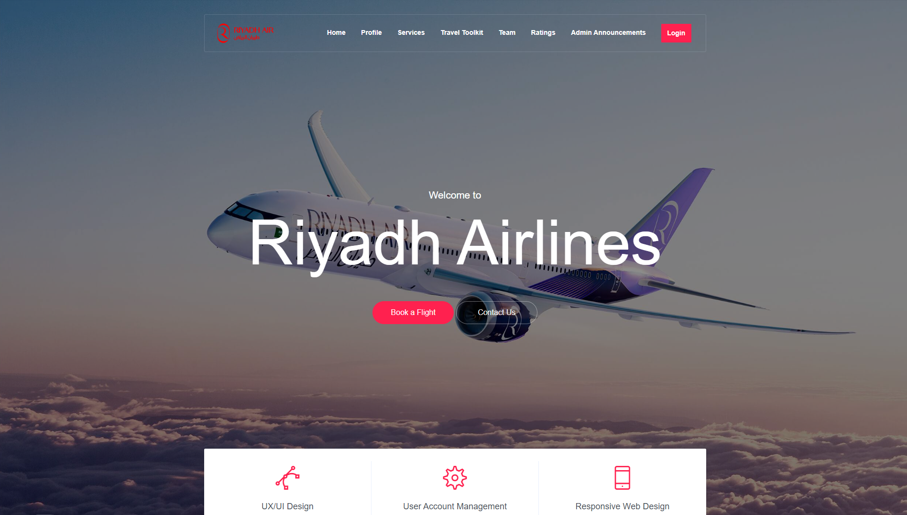

### Home Page

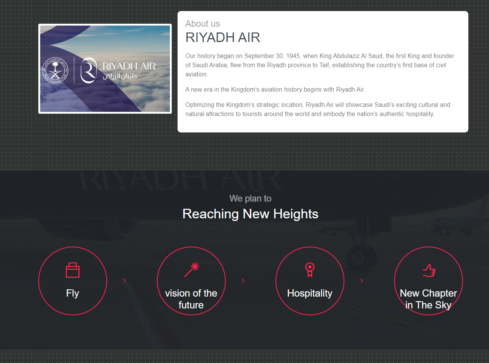

### Home Page


### Home Page

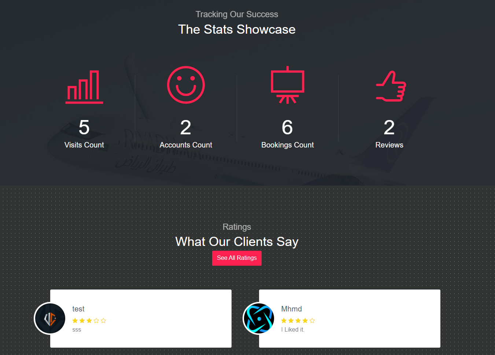

### Home Page

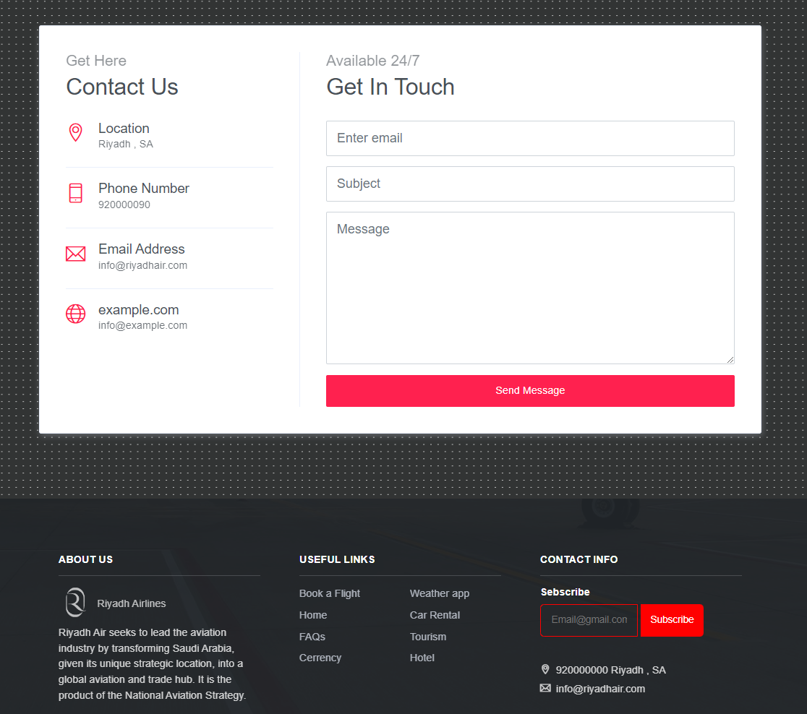

### Search Flight Page

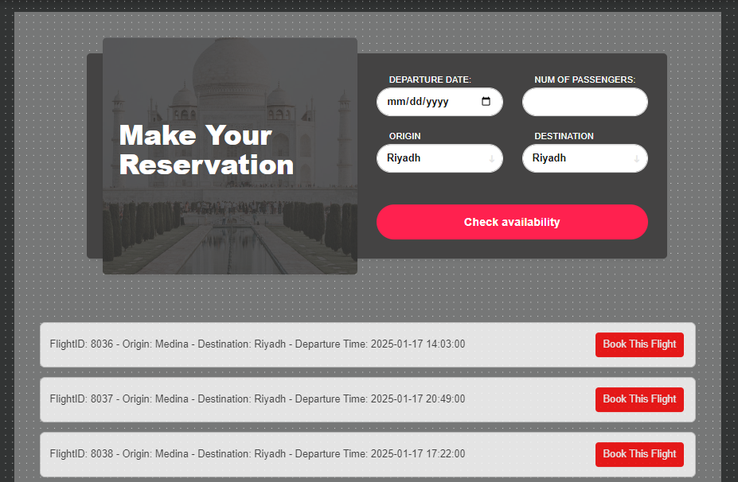

### Seat Selection Page

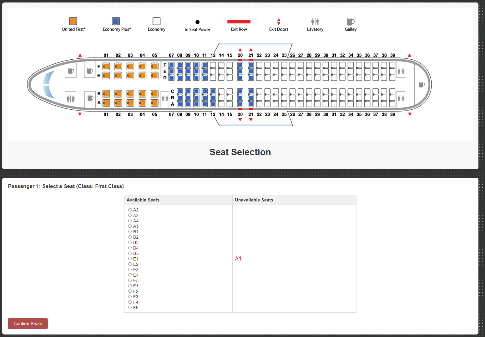

### Account Page

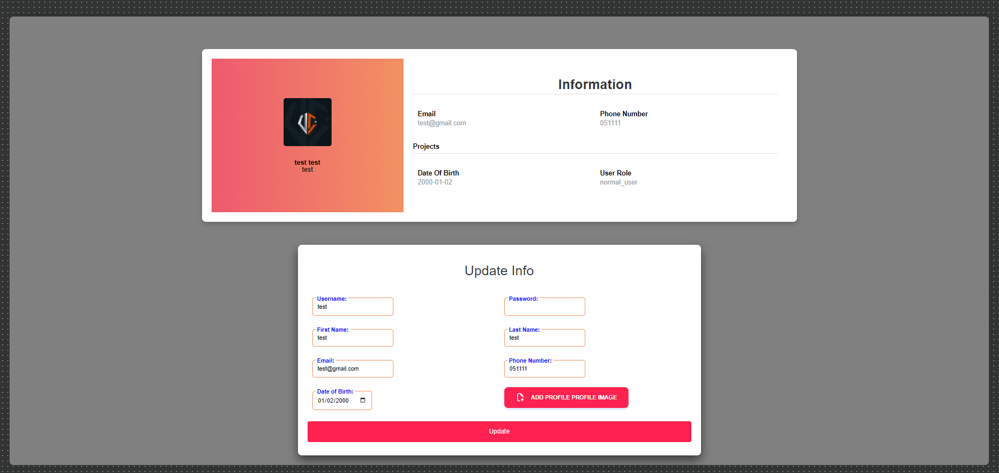

### Account Page

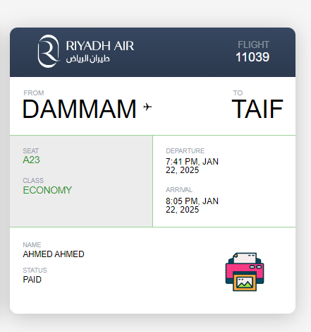

### FAQ Page

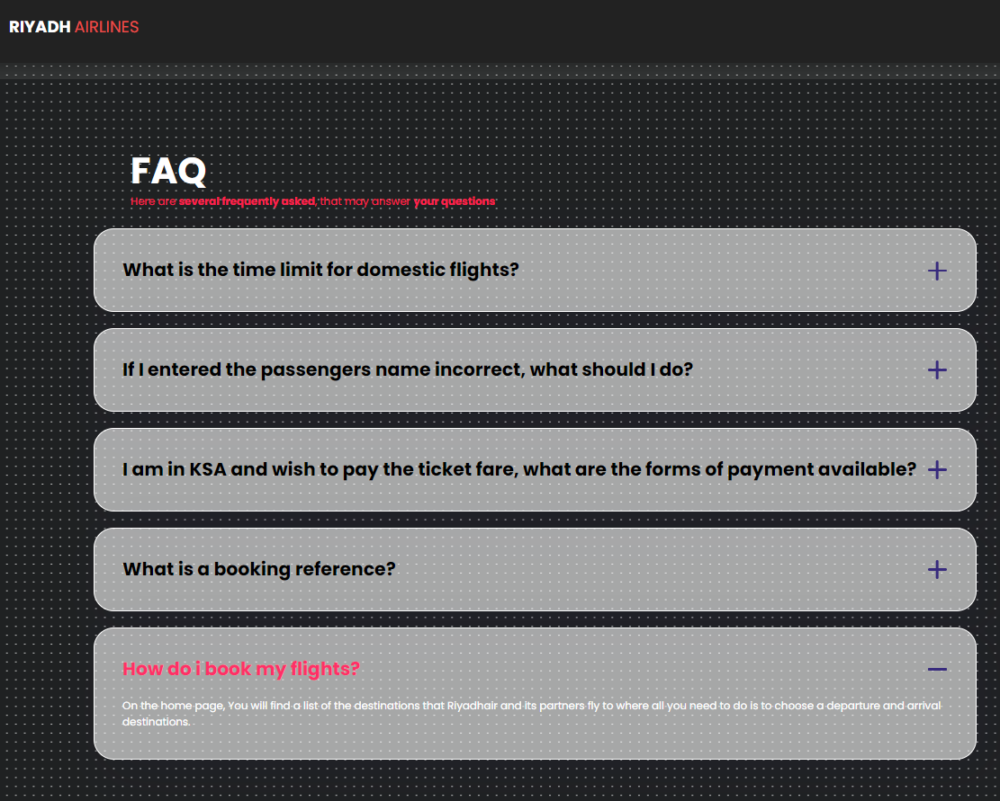

### Festivals Page

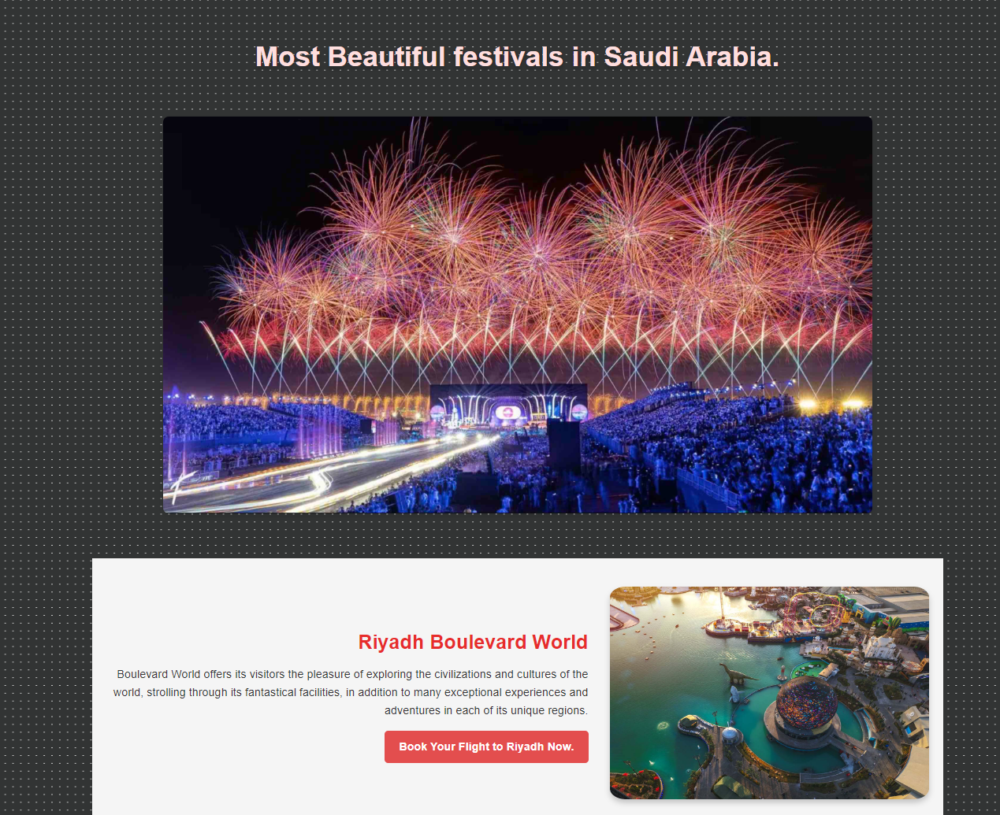

### Hotels Page

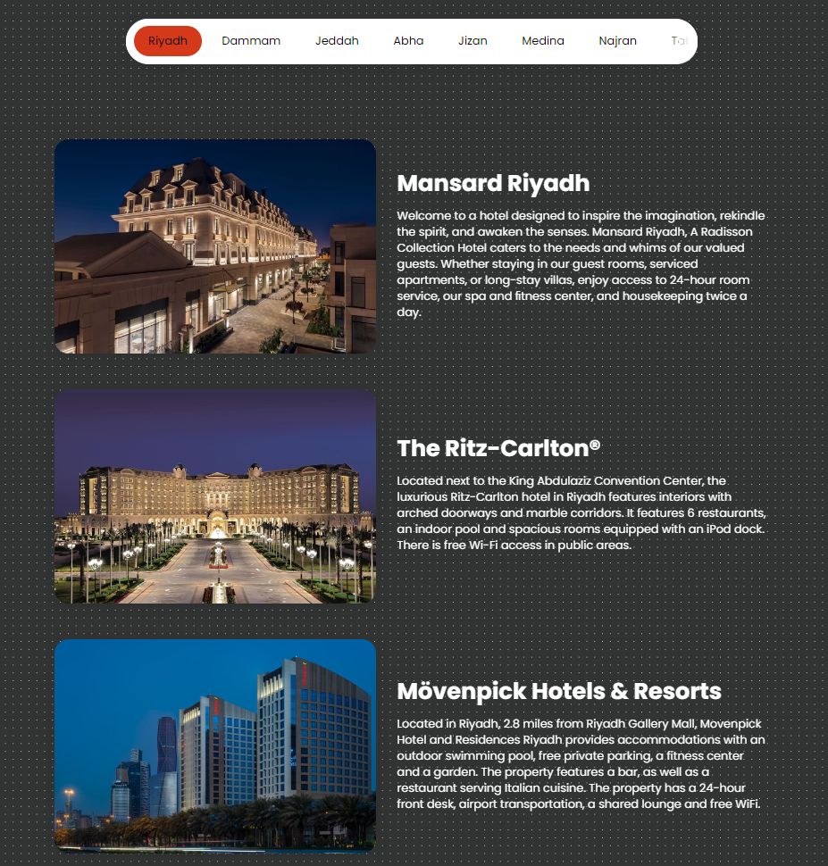

### Admin Dashbord Page

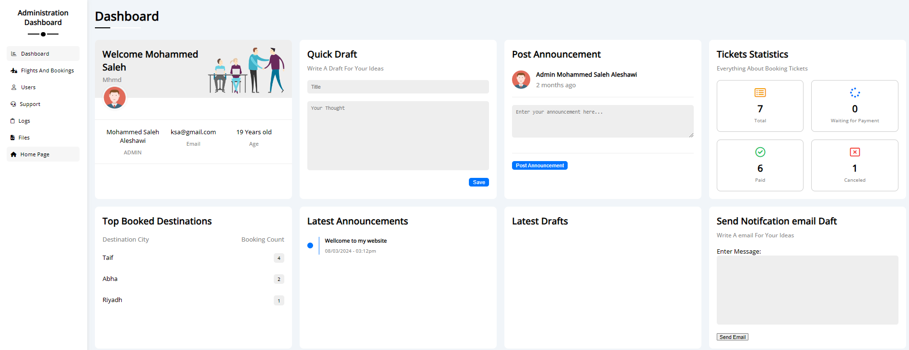

### Admin Dashbord Page

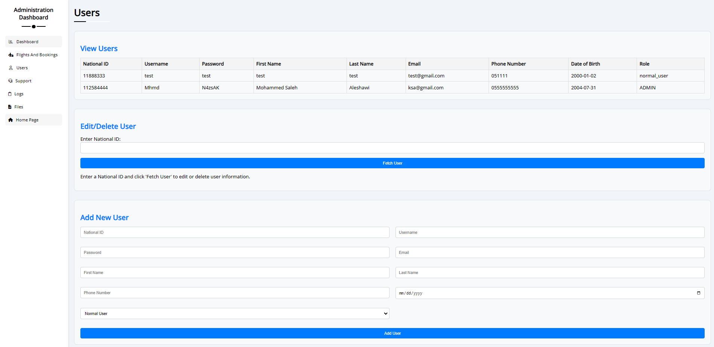

### Admin Dashbord Page

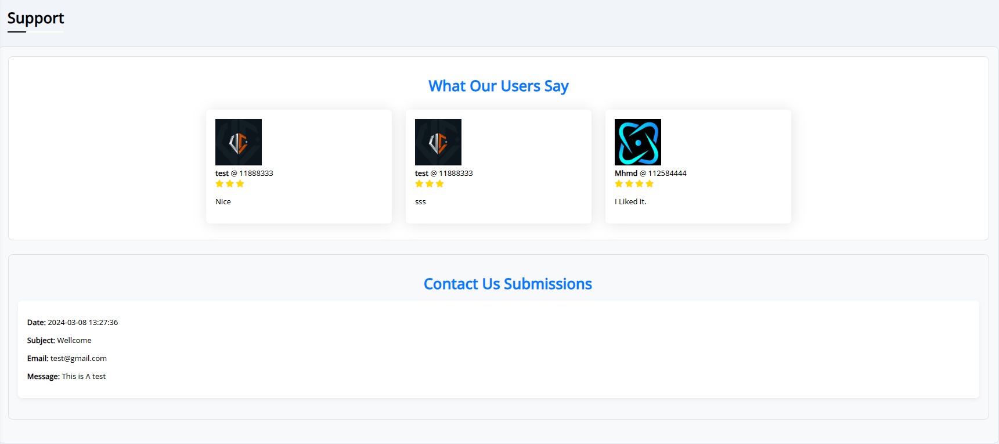

### Login Page

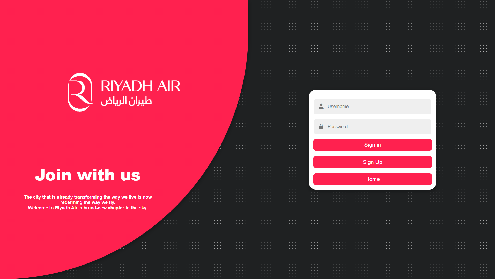

## Copyrights Document

For detailed information on copyrights and attributions, refer to the [Copyrights Document](Filesuploads/Copyrights.pdf).

### Riyadh Airlines Booking System

This document outlines the copyrights and attributions for various elements used in the development of the Riyadh Airlines Booking System.

#### Frontend Templates

- **Home Page Template:**
  - Template: 2019 Devcrud (creative-studio).
  - Attribution: Creative Studio
- **Profile Card CSS:**
  - CSS: BBBootstrap Team 2019.
  - Attribution: BBBootstrap Team
- **Flight Search Form CSS:**
  - CSS: Colorlib.
  - Attribution: Colorlib
- **Booking Form CSS:**
  - CSS: Colorlib.
  - Attribution: Colorlib
- **Ticket CSS:**
  - CSS: 2022 by Sander (Sandroid).
  - Attribution: Sander (Sandroid)
- **Dashboard Page CSS:**
  - CSS: Daikii1 (GitHub).
  - Attribution: Daikii1 GitHub

#### Backend and Code Contributions

- **Backend Logic:**
  - Assistance and inspiration from GitHub repositories.
- **Programming Team:**
  - 90% of the code developed by Mohammed Aleshawi.
  - Additional contributions from the rest of the programming team.

#### Academic Support

- **College Instructors:**
  - Acknowledgment and gratitude for the guidance and support received from college instructors and doctors.

## Disclaimer

For detailed information about the nature of this project, refer to the [Disclaimer](Filesuploads/Disclaimer.pdf).

### Introduction

This document serves as a disclaimer for the graduation project titled "Riyadh Airlines Booking System" undertaken by Mohammed Aleshawi as part of the academic requirements for the Applied College at Imam Mohammad Ibn Saud Islamic University. The purpose of this disclaimer is to clarify the nature of the project, its fictional aspects, and to emphasize that it is not associated with any real or existing airline company.

### Project Overview

The project "Riyadh Airlines Booking System" is a simulation and conceptual exercise created solely for academic purposes. It is not a real airline booking system, and any resemblance to actual airlines or booking systems, living or dead, is purely coincidental. The project is intended to showcase the skills and knowledge acquired during the course of the Graduation Project at Imam Mohammad Ibn Saud Islamic University.

### Fictional Nature

Riyadh Airlines, its booking system, services, routes, and any related content within this project are entirely fictional. The project is a result of creative imagination and does not represent an actual business entity. The use of the company name "Riyadh Air" and its booking system is for illustrative purposes within the context of the project and should not be interpreted as an endorsement or affiliation with any existing entity.

### Non-Commercial Intent

This graduation project is not intended for commercial use or distribution. It is a student's academic endeavor and should be treated as such. No commercial transactions, services, or products associated with Riyadh Airlines Booking System are available or will be provided.

### Educational Purpose

The primary goal of this project is to demonstrate the academic and creative abilities of Mohammed Aleshawi and others as students of the Applied College at Imam Mohammad Ibn Saud Islamic University. It does not aim to deceive, mislead, or infringe upon the rights of any real entity.

### Legal Disclaimer

By accessing or using any content related to Riyadh Airlines Booking System, you acknowledge that this is a fictional project created for educational purposes only. Imam Mohammad Ibn Saud Islamic University, Applied College, and Mohammed Aleshawi bear no responsibility for any misunderstanding, misinterpretation, or misuse of the project content.

### Contact Information

For any inquiries or clarifications regarding this disclaimer or the Riyadh Airlines Booking System project, please contact Mohammed Aleshawi.

### Acknowledgment

I, Mohammed Aleshawi, hereby acknowledge that this disclaimer accurately reflects the nature of the Riyadh Airlines Booking System graduation project, and I understand the importance of distinguishing it as a fictional work created for educational purposes.
